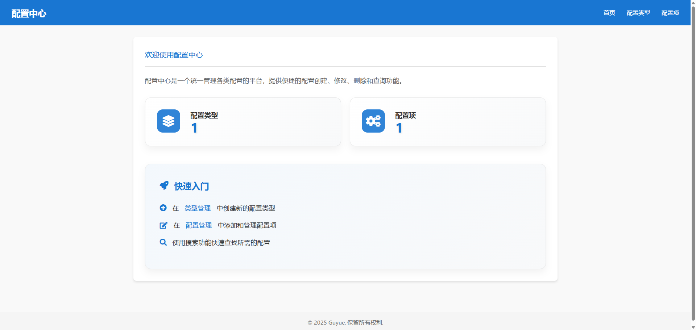
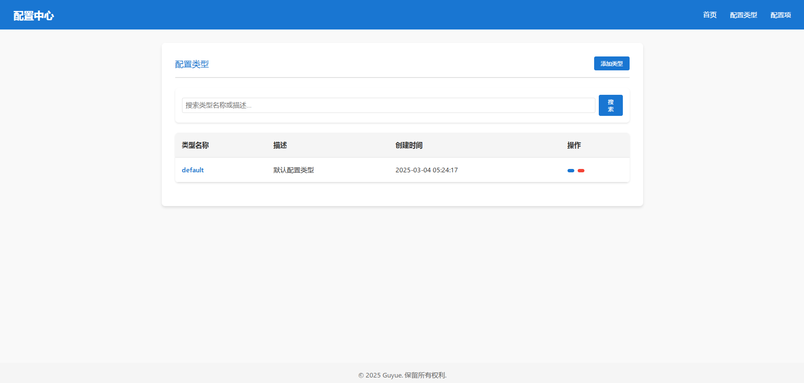
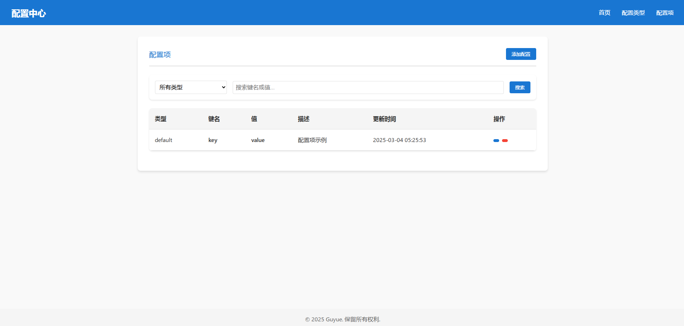

# Config Center (配置中心)

[](https://fastapi.tiangolo.com)
[](https://www.python.org/)
[](https://www.sqlite.org/)
[](LICENSE)

基于FastAPI开发的现代化配置中心，提供统一的配置管理解决方案。通过直观的Web界面和RESTful API，实现配置的集中化管理与便捷操作。

## ✨ 主要特性

- 🔄 **配置管理**
  - 支持多种配置类型
  - 提供配置的增删改查功能
  - 实时配置更新，无需重启服务

- 🌐 **Web界面**
  - 现代化的用户界面设计
  - 直观的配置操作体验
  - 支持配置搜索与筛选

- 🔌 **API集成**
  - RESTful API接口
  - 支持多种客户端集成
  - 详细的API文档

## 🛠️ 技术栈

- **后端框架**: FastAPI
- **数据库**: SQLite
- **ORM**: SQLAlchemy
- **前端框架**: 原生JavaScript + 模板引擎
- **文档**: OpenAPI (Swagger)

## 🚀 快速开始

### 环境要求

- Python 3.7+
- pip

### 安装

1. 克隆仓库
```bash
git clone https://github.com/guyue55/config_center.git
cd config_center
```

2. 安装依赖
```bash
pip install -r requirements.txt
```

3. 运行服务
```bash
python run.py
```

访问 http://localhost:8000 即可打开Web界面

## 📚 API文档

启动服务后，访问以下地址查看API文档：

- Swagger UI: http://localhost:8000/docs
- ReDoc: http://localhost:8000/redoc

## 🔧 配置说明

主要配置文件位于 `app/core/config.py`，包含以下配置项：

- 服务端口
- 数据库连接
- 日志配置
- 其他系统参数

## 💫 页面展示

### 首页



首页展示了系统的整体概况，包括最近的配置变更、统计数据和快速操作入口。

### 配置类型页面



配置类型页面提供了对不同类型配置的管理功能，支持添加、编辑和删除配置类型。

### 配置项页面



配置项页面展示了所有的配置内容，提供了搜索、筛选和编辑功能。

## 📦 部署

### Docker部署

```bash
# 构建镜像
docker build -t config-center .

# 运行容器
docker run -d -p 8000:8000 config-center
```

### 传统部署

1. 安装Python环境
2. 安装项目依赖
3. 使用gunicorn或uvicorn启动服务

## 🤝 贡献指南

欢迎提交Issue和Pull Request！

## 📄 开源协议

本项目采用 [MIT](LICENSE) 协议。